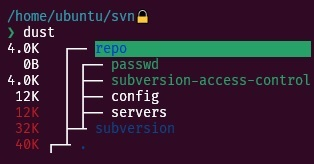
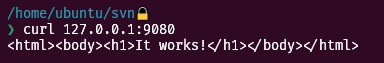
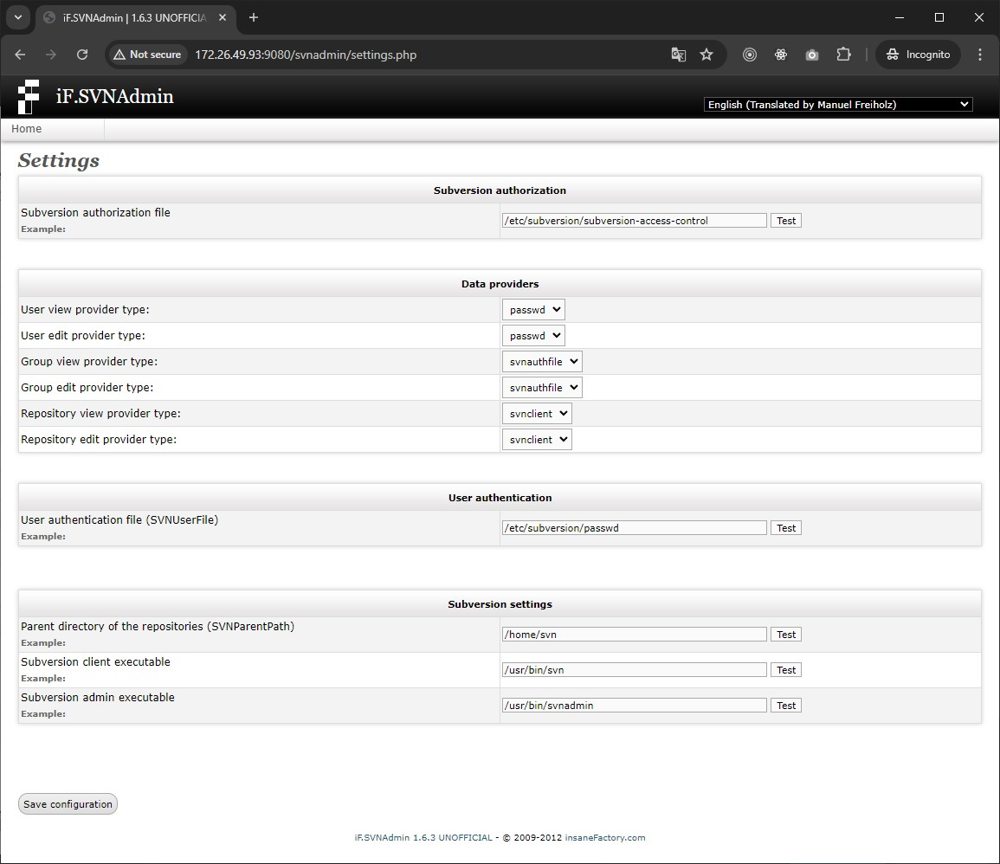
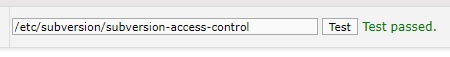
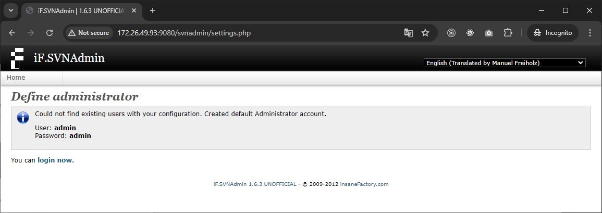

# SVN in Docker

a old guy ask for SVN, so comes it

## Description

* easy to deploy
* NO 3690 port

## Take note

For things not included or mentioned, please go to the original repository to find and study it


## Install & Usage

below tested in Ubuntu 20.04

> assuming your working directory is `/home/ubuntu/svn`

### Step 0: Caddy config example 

**[Optional]** you'd better secure it with https. for caddy can easy config like below

```json
{
    "apps": {
        "http": {
            "servers": {
                "srv0": {
                    "listen": [":443"],
                    "logs": {
                        "logger_names": {
                            "svn.your-little-domain.com": "log3"
                        }
                    },
                    "metrics": {},
                    "routes": [
                        {
                            "match": [
                                {
                                    "host": ["svn.your-little-domain.com"]
                                }
                            ],
                            "handle": [
                                {
                                    "handler": "reverse_proxy",
                                    "upstreams": [
                                        {
                                            "dial": "127.0.0.1:9080"
                                        }
                                    ]
                                }
                            ],
                            "terminal": true
                        }
                    ]
                }
            }
        }
    },
    "logging": {
        "logs": {
            "default": {
                "exclude": [
                    "http.log.access.log3"
                ]
            },
            "log3": {
                "encoder": { "format": "console" },
                "include": ["http.log.access.log3"],
                "writer": {
                    "filename": "/home/ubuntu/caddy/logs/svn/svn.log",
                    "output": "file",
                    "roll_keep": 90,
                    "roll_keep_days": 90,
                    "roll_local_time": true
                }
            }
        }
    }
}

```

### Step 1: prepare files


creat directory `/home/ubuntu/svn/repo`

Copy all files in `/subversion_config` to `/home/ubuntu/svn/subversion`



### Step 2: set permission

```bash
chmod 777 /home/ubuntu/svn/repo
chmod 777 /home/ubuntu/svn/subversion/passwd
chmod 777 /home/ubuntu/svn/subversion/subversion-access-control
```

### Step 3: start it

```bash
sudo docker run --privileged=true \
-d \
--name your-svn-server \
-p 9080:80 \
-v /home/ubuntu/svn/repo:/home/svn \
-v /home/ubuntu/svn/subversion/subversion-access-control:/etc/subversion/subversion-access-control \
-v /home/ubuntu/svn/subversion/passwd:/etc/subversion/passwd \
ammrage/svn:latest
```

### Step 4: verify and setup

run to verify

```bash
curl 127.0.0.1:9080
```



open http://127.0.0.1:9080/svnadmin to setup



do **CLICK** `all` the test button and it show green at right of the button `Test passed`



then click save configuration and then you will see



then you can login with the default usename and password.

### Step 5: Enjoy your own SVN server if you do